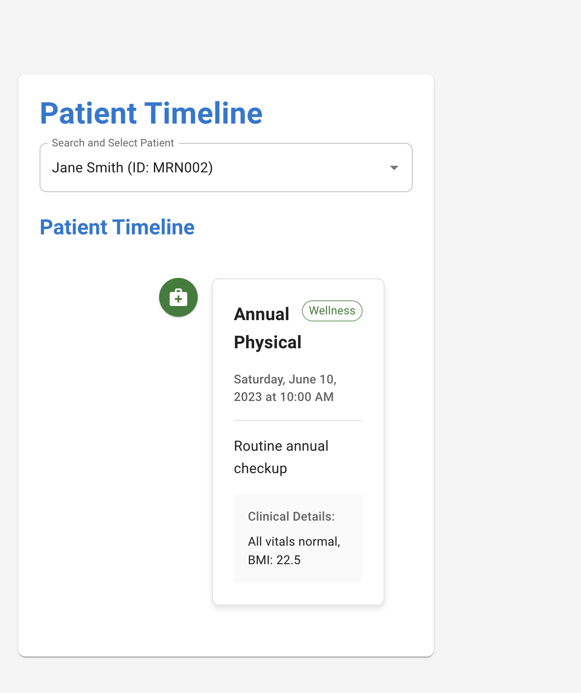
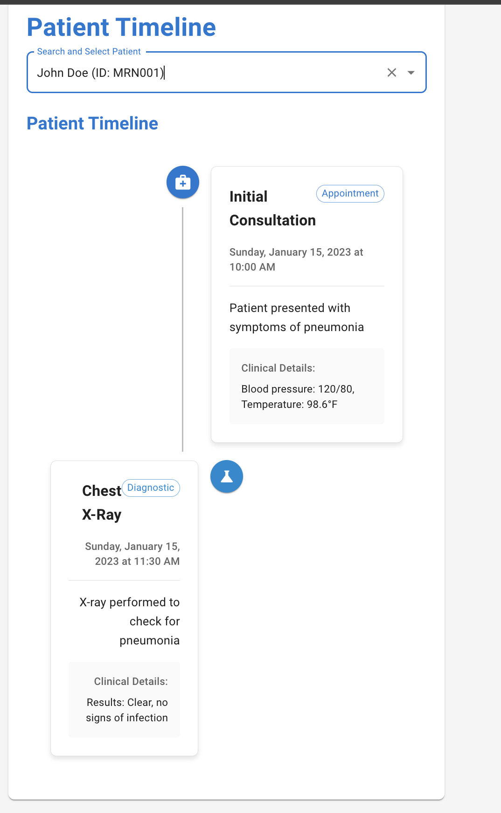
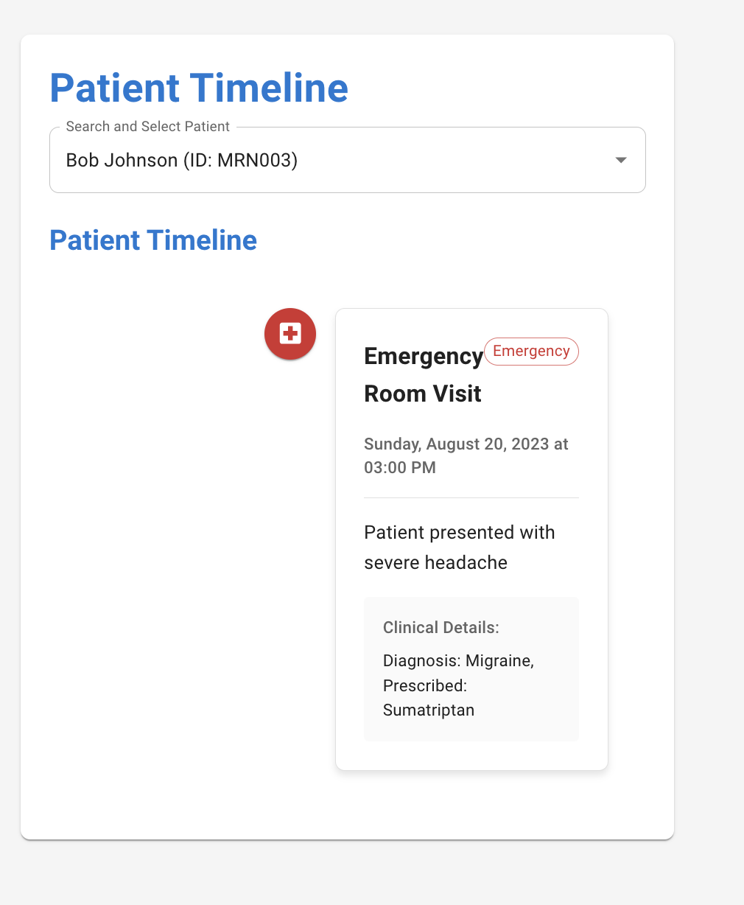
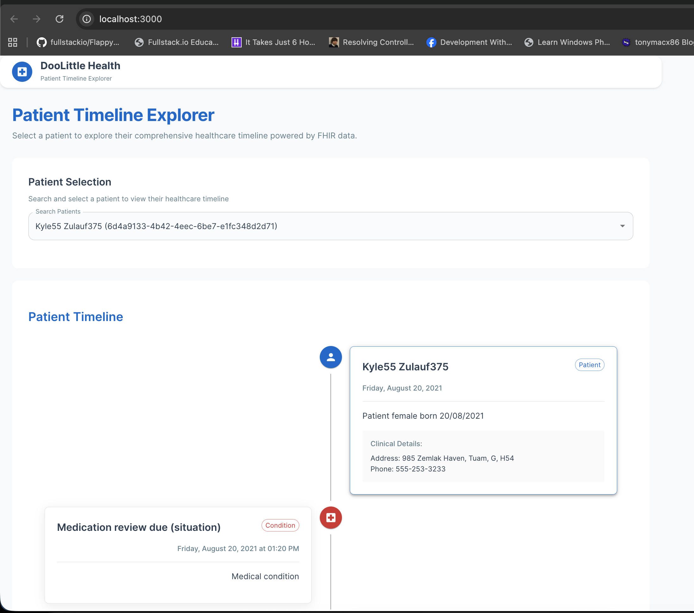
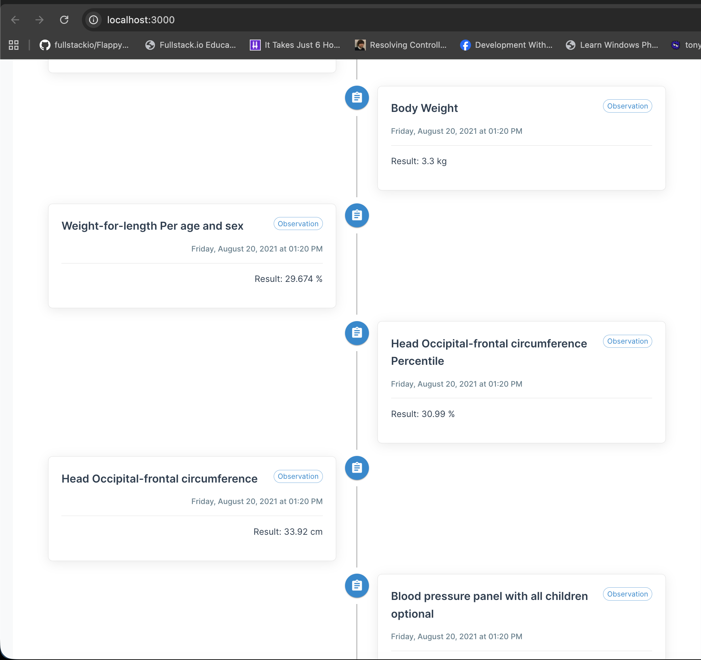

# DooLittle Health Patient Timeline

A full-stack web application for visualizing patient medical timelines built with enterprise-grade architecture.

## About

This is an example project built by **Nithin Mohan T K** out of curiosity and fun, experimenting with modern web development technologies and cloud infrastructure. It demonstrates enterprise-grade architecture patterns while serving as a learning and experimentation platform.

## Features

- View patient timelines with chronological events
- RESTful API backend built with ASP.NET Core
- React frontend with Material-UI components
- Multi-database support (SQLite for development, PostgreSQL for production)
- Docker containerization
- Kubernetes deployment manifests
- Swagger/OpenAPI documentation

## Architecture

```
DooLittle.Health.PatientTimeline/
├── src/
│   ├── DooLittle.Health.PatientTimeline.Api/     # ASP.NET Core Web API
│   └── DooLittle.Health.PatientTimeline.Web/     # React Frontend
├── deployments/                                 # Deployment configurations
│   ├── docker/                                   # Docker files
│   ├── k8s/                                      # Kubernetes manifests
│   └── terraform/                                # Azure infrastructure as code
└── docker-compose.yml                           # Local development setup
```

## Architecture Documentation

Comprehensive architecture documentation is available in C4 model format:

- **File**: `docs/architecture.drawio`
- **Format**: Draw.io file with multiple pages containing prompts for all architectural diagrams
- **Diagrams Included**:
  - C4 Context, Container, and Component diagrams
  - Process Flow, HLD, LLD diagrams
  - Interaction, Activity, Deployment, and Network diagrams

Open the file in Draw.io desktop application to view and edit the diagrams.

## Tech Stack

- **Backend**: .NET 10, ASP.NET Core Web API, Entity Framework Core, PostgreSQL/SQLite
- **Frontend**: React 19, TypeScript, Vite, Material-UI
- **Database**: PostgreSQL (production) / SQLite (development)
- **Infrastructure**: Docker, Kubernetes, Nginx
- **Documentation**: Swagger/OpenAPI

## Getting Started

### Prerequisites

- .NET 10 SDK
- Node.js 18+ (preferably 20+ for Vite)
- Docker & Docker Compose (for containerized development)
- kubectl (for Kubernetes deployment)

### Local Development Setup

#### Option 1: Docker Compose (Recommended)

1. Clone the repository and navigate to the project directory
2. Run the application using Docker Compose:
   ```bash
   docker-compose up --build
   ```

The application will be available at:
- **Frontend**: `http://localhost:3000`
- **API**: `http://localhost:8080`
- **API Documentation**: `http://localhost:8080/docs`

#### Option 2: Manual Setup

1. **Backend Setup**:
   ```bash
   cd src/DooLittle.Health.PatientTimeline.Api
   dotnet restore
   dotnet run
   ```

2. **Frontend Setup**:
   ```bash
   cd src/DooLittle.Health.PatientTimeline.Web
   npm install
   npm run dev
   ```

### Production Deployment

#### Kubernetes Deployment

1. Create the namespace:
   ```bash
   kubectl apply -f deployments/k8s/namespace.yaml
   ```

2. Deploy the application:
   ```bash
   kubectl apply -f deployments/k8s/
   ```

3. Access the application at `https://patient-timeline.doolittle.health`

#### Docker Deployment

1. Build and run the containers:
   ```bash
   docker-compose -f docker-compose.yml up --build -d
   ```

## API Documentation

When running in development mode, Swagger UI is available for interactive API documentation and testing:

- **Swagger UI**: `http://localhost:8080/docs`
- **OpenAPI JSON**: `http://localhost:8080/swagger/v1/swagger.json`

The Swagger interface allows you to:
- View all available API endpoints
- See request/response schemas
- Test API calls directly from the browser
- Explore the Patient and TimelineEvents APIs

## Using Synthea Dataset

This application can import patient data from Synthea-generated CSV files.

1. Download the CSV files from your Synthea output (e.g., from the GitHub repo mentioned).

2. Place the following CSV files in `data/csv/`:
   - `patients.csv`
   - `encounters.csv`
   - `conditions.csv`
   - `medications.csv`
   - `procedures.csv`
   - `observations.csv`
   - `immunizations.csv`

3. Restart the backend application. It will automatically import the data on startup.

The import maps Synthea data to the application's Patient and TimelineEvent models, creating a chronological timeline of medical events for each patient.

## Screenshots

### Patient Selection Interface


### Timeline View





### Application Architecture


## Contributing

Contributions are welcome! Please feel free to submit a Pull Request.

## License

This project is licensed under the MIT License - see the [LICENSE](LICENSE) file for details.
